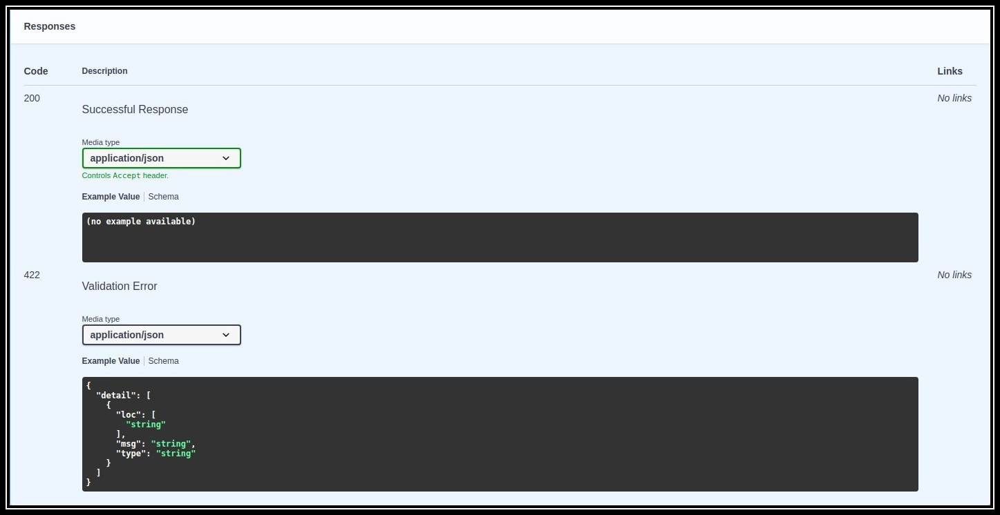
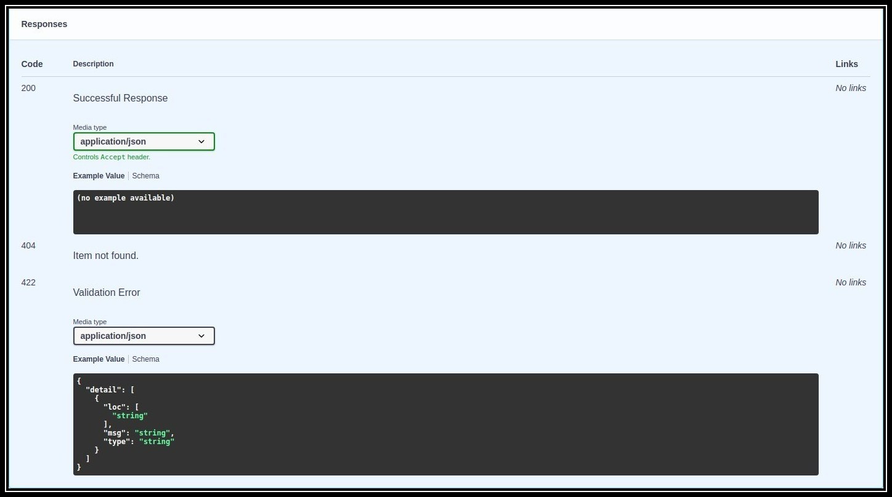

<h1 align="center">
    <strong>FastAPI Responses</strong>
</h1>
<p align="center">
    <a href="https://github.com/Kludex/fastapi-responses" target="_blank">
        
    </a>
        
        
    <br />
    <a href="https://pypi.org/project/fastapi-responses" target="_blank">
        
    </a>
    
    
</p>

<p align="center">
    <strong>This package is not stable. Do not use in production!</strong>
</p>

Find **HTTPException**s and turn them into documented **responses**. :tada:

## Installation

``` bash
pip install fastapi-responses
```

## Usage

The simplest use case happens when we have a single exception being raised. We don't want to document the possible response manually, so **FastAPI Responses** comes in handy.

``` python
from fastapi import FastAPI, HTTPException
from fastapi_responses import custom_openapi

app = FastAPI()

app.openapi = custom_openapi(app)

@app.get("/{item_id}")
def get_item(item_id: int):
    if item_id == 0:
        raise HTTPException(status_code=404, detail="Item not found.")
    return "Item exists!"
```

### Without FastAPI Responses



### With FastAPI Responses



## Roadmap

- [X] Extract HTTPException from stack.
- [ ] Extract any exception and document based on the `exception_handler` container.
- [ ] Accept Python objects on `HTTPException` instantiation.

## License

This project is licensed under the terms of the MIT license.
